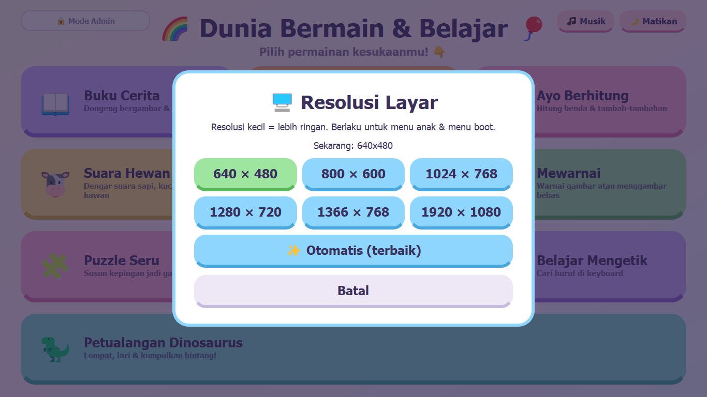
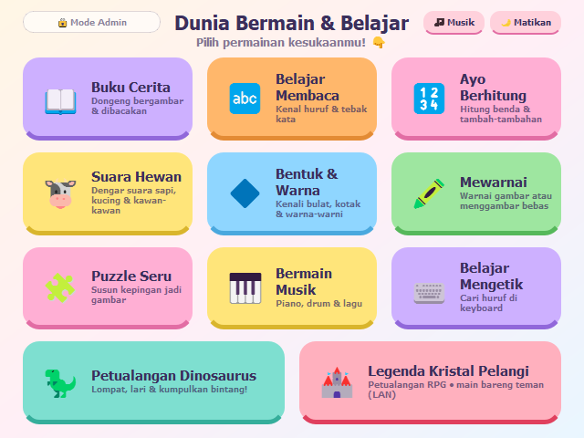
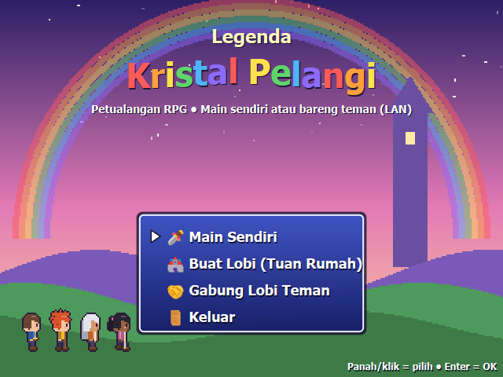
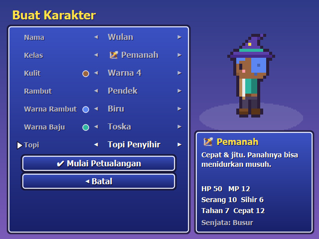
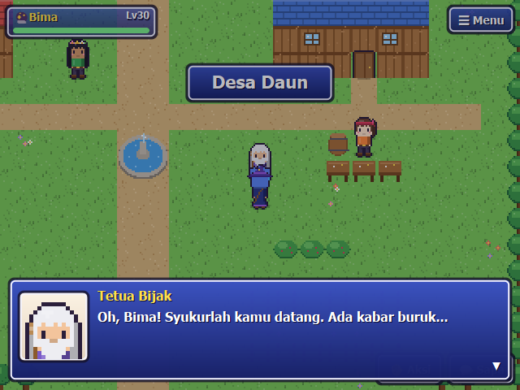
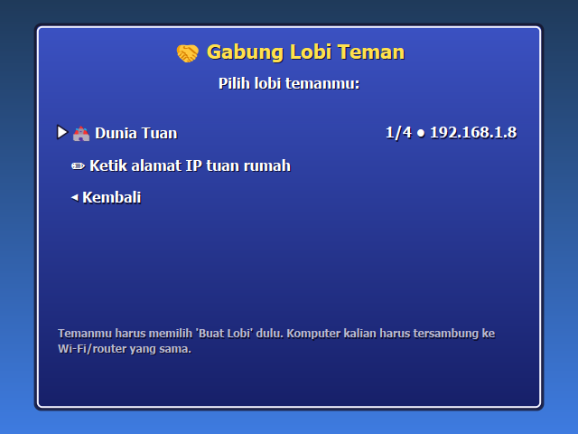
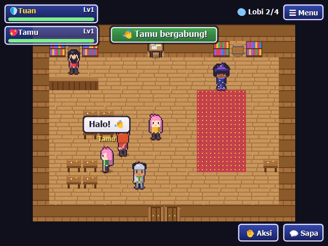
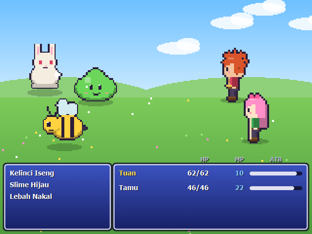
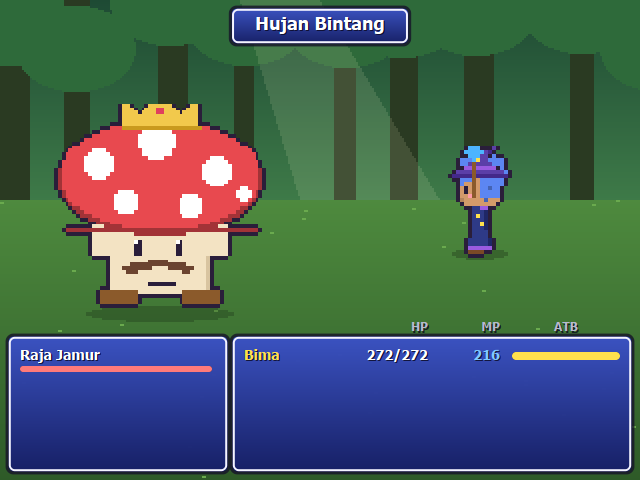
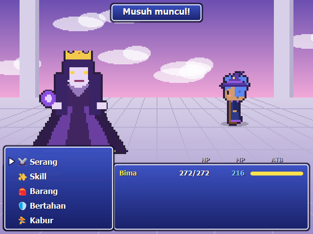

# 🌈 KidsOS: antiX Linux untuk Anak

**KidsOS** mengubah [antiX Linux](https://antixlinux.com) menjadi sistem operasi khusus anak.
Setelah komputer dinyalakan, anak langsung melihat menu **Dunia Bermain & Belajar**.
Tidak ada layar login, desktop, atau terminal yang bisa dibuka anak.
Orang tua tetap bisa mengatur sistem lewat **Mode Admin** berpassword.


## ✨ Fitur

- **Langsung ke menu anak** setelah boot: login otomatis, tanpa desktop, dengan `Alt+Tab`, `Alt+F4`, `Ctrl+Alt+F1..F12` dan kombinasi sejenis diblokir.
- **11 aktivitas bawaan**, semuanya jalan tanpa internet dan tanpa aplikasi tambahan.
- **🏰 RPG Legenda Kristal Pelangi**: petualangan 2D ala Final Fantasy dengan cerita, 4 kelas, karakter yang bisa dikustom, senjata & baju, dan **co-op sampai 4 pemain lewat LAN** (bertemu di lobi).
- **Suara di mana-mana**: bunyi "pop" di setiap tombol, musik latar yang berbeda di tiap menu, efek benar/salah, suara hewan, dan teks dibacakan dalam bahasa Indonesia (espeak-ng). Musik bisa dimatikan dengan tombol 🎵.
- **Menu boot dan animasi boot** bertema anak (opsional, `BOOT_VISUALS=on`; default mati selama tahap uji).
- **Ringan untuk PC lama**: menu anak memakai resolusi default **640×480** (60 Hz, hanya jika
  didukung monitor). Admin bisa mengubahnya lewat Panel Admin → 🖥️ Resolusi.
- **Menu boot pemulihan**: *KidsOS - Mode Aman*, *Mode Aman Grafis (nomodeset)*, dan *antiX biasa*.
- **Mode Admin**: Desktop Admin (IceWM), terminal, repository menu, update dan upgrade.
- **Update aman**: update dan upgrade wajib memakai login akun admin Linux (root atau anggota grup `sudo`).
- **Menu bisa ditambah dari repository**: cukup edit `menu.json` dan `content/` di repo ini, lalu tekan **Update Menu**.

## 📸 Tampilan

### Saat komputer menyala

| Menu boot (GRUB) | Animasi boot | Layar sambutan |
|---|---|---|
|  |  |  |

### Aktivitas

| | | |
|---|---|---|
| **📖 Buku Cerita**  | **🔤 Kenal Huruf**  | **🧩 Tebak Kata**  |
| **🔢 Ayo Berhitung**  | **🐮 Suara Hewan**  | **🔷 Bentuk & Warna**  |
| **🖍️ Mewarnai**  | **🧩 Puzzle Seru**  | **🎹 Bermain Musik**  |
| **⌨️ Belajar Mengetik**  | **🦖 Petualangan Dinosaurus**  | **📚 Rak Cerita**  |

### Mode Admin

| Password Mode Admin | Panel Admin | Repository menu |
|---|---|---|
|  |  |  |
| **Login untuk update** | **Resolusi layar** | **Menu anak di 640×480** |
|  |  |  |

### 🏰 RPG Legenda Kristal Pelangi

| Layar judul | Buat karakter | Desa Daun |
|---|---|---|
|  |  |  |
| **Gabung lobi teman** | **Bertemu di lobi (Kedai Petualang)** | **Bertarung bersama (co-op)** |
|  |  |  |
| **Bos: Raja Jamur** | **Bos terakhir: Ratu Bayangan** | |
|  |  | |

## 🎮 Isi aktivitas

| Menu | Isi |
|---|---|
| 📖 Buku Cerita | 5 cerita bergambar (Kura-kura dan Kelinci, Kancil dan Buaya, Semut dan Belalang, dan lainnya) dengan tombol 🔊 Bacakan |
| 🔤 Belajar Membaca | Kenal Huruf A–Z bergambar, dan kuis Tebak Kata |
| 🔢 Ayo Berhitung | Menghitung benda (1–10) dan penjumlahan sampai 10 |
| 🐮 Suara Hewan | 16 hewan dengan suaranya, dan kuis Tebak Hewan dari suara |
| 🔷 Bentuk & Warna | Tebak Bentuk dan Tebak Warna |
| 🖍️ Mewarnai | 6 gambar untuk diwarnai dengan sentuhan, Gambar Bebas pakai kuas, lalu bisa disimpan ke `~/Gambar` |
| 🧩 Puzzle Seru | 8 gambar, level 2×2, 3×3, dan 4×4 |
| 🎹 Bermain Musik | Piano Do–Do' (juga dengan tombol `A S D F G H J K`), drum, dan 3 lagu contoh dengan tuts yang menyala |
| ⌨️ Belajar Mengetik | Cari Huruf di keyboard dan Ketik Kata, dengan keyboard di layar sebagai petunjuk |
| 🦖 Petualangan Dinosaurus | Lari, lompati kaktus, dan kumpulkan bintang |
| 🏰 Legenda Kristal Pelangi | RPG petualangan: 6 peta, 3 bos, cerita sampai tamat, main sendiri atau co-op LAN (lihat di bawah) |

Setiap jawaban benar memberi ⭐, dan setiap kelipatan 5 bintang ada perayaan kecil 🎉.

## 🏰 Legenda Kristal Pelangi (RPG)

Kristal Pelangi pecah menjadi tiga, dan warna dunia mulai memudar. Pemain menjadi pahlawan dari
Desa Daun yang mengumpulkan kembali pecahan **Hijau** (Hutan Bisik), **Biru** (Gua Kristal), dan
**Merah** (Menara Awan). Ceritanya ramah anak: musuh "kabur" atau "pingsan", dan bos-bosnya
akhirnya menjadi teman. Dialog bisa dibacakan (espeak-ng).

- **Karakter bisa dikustom**: nama, kelas, warna kulit, 5 gaya rambut, 8 warna rambut, 8 warna baju,
  dan topi (pita, topi penyihir, bandana, mahkota bunga, helm).
- **4 kelas**: 🛡️ Kesatria (pedang), 🔮 Penyihir (sihir api/es/petir), 🏹 Pemanah (panah tidur),
  💖 Penyembuh (menyembuhkan & membangunkan teman). Kelas bisa diganti di Kedai Petualang.
- **Senjata & baju** terlihat di karakter: 16 senjata, 8 baju (kain, kulit, zirah, jubah, jubah
  bintang, zirah kristal, pengembara, pelangi), dan 4 aksesori. Beli di toko, temukan di peti.
- **Pertarungan ala Final Fantasy** (ATB): Serang, Skill, Barang, Bertahan, Kabur; kelemahan
  elemen; level sampai 30.
- **Grafis pixel-art & musik digambar/disintesis lewat kode**: tanpa file gambar atau suara tambahan.
  Ringan: sekitar 20 MB RAM tambahan dan beberapa milidetik per frame di 640×480.

**Kontrol:** panah/WASD = jalan • Enter/Spasi/Z = bicara & OK • Esc/X = menu & kembali •
angka 1–6 = sapa teman. Dengan mouse: tahan klik untuk berjalan, klik orang/peti di sebelahmu, dan
pakai tombol ☰ Menu, 💬 Sapa, ✋ Aksi di layar.

### Main bersama lewat LAN (co-op)

1. Semua komputer tersambung ke Wi-Fi/router yang sama.
2. Satu anak memilih **Buat Lobi (Tuan Rumah)**. Dunianya terbuka, dan ia mulai di
   **Kedai Petualang** (lobi).
3. Teman-temannya memilih **Gabung Lobi Teman**. Lobi muncul otomatis. Jika tidak muncul, pilih
   *Ketik alamat IP* dan masukkan alamat yang tertera di **Papan Pesta** kedai.
4. Semua bertemu di kedai, lalu berpetualang bersama (maksimal 4 pemain). Pertarungan dilawan
   bersama, dan setiap pemain memilih perintah untuk karakternya sendiri.

Kemajuan cerita disimpan di komputer tuan rumah. Level, uang, barang, dan perlengkapan setiap pemain
disimpan di komputernya masing-masing (`~/.local/share/kidsos/rpg/`, 3 slot karakter).
Jaringan memakai port **UDP 47777** (pencarian lobi) dan **TCP 47778** (permainan). Jika antiX
memakai firewall, buka kedua port itu.

Admin juga bisa menjalankan permainan di Desktop Admin: `kidsos-rpg` (layar penuh) atau
`kidsos-rpg --window`.

## 💾 Instalasi (antiX Linux)

```sh
git clone https://github.com/Mrx112/OSAnak.git
cd OSAnak
python3 packaging/build_deb.py                  # -> dist/kidsos_1.3.0_all.deb
sudo apt install ./dist/kidsos_1.3.0_all.deb
sudo reboot
```

Selama instalasi kamu akan diminta membuat **password Mode Admin**. Installer akan:

1. Membuat user `anak` (tanpa password dan tanpa sudo) yang login otomatis di tty1.
2. Mematikan layar login dan desktop, lalu menjalankan menu anak sebagai satu-satunya tampilan.
3. Membuat semua suara dan musik (sekali saja, sekitar 1 menit).
4. Menyiapkan menu boot: GRUB standar antiX (parameter `vga=`, `video=`, dan `splash` dibuang,
   `GRUB_GFXPAYLOAD_LINUX` dinonaktifkan) + menu pemulihan, lalu `update-grub`.

### Tahap uji di VirtualBox

Secara default KidsOS **tidak** mengubah tampilan boot maupun Xorg, agar tidak bentrok dengan
adapter grafis VirtualBox (VMSVGA/VBoxSVGA):

| Pengaturan di `/etc/kidsos/kidsos.conf` | `off` (default) | `on` |
|---|---|---|
| `BOOT_VISUALS` | GRUB standar, tanpa animasi boot | tema GRUB (gfxterm) + animasi boot di framebuffer |
| `XORG_LOCK` | tidak ada file di `/etc/X11` | `xorg.conf.d/90-kidsos.conf`: blokir `Ctrl+Alt+F1..F12` & `Ctrl+Alt+Backspace` |

Setelah mengubah nilainya, jalankan `sudo kidsos-setup enable`. Nyalakan `XORG_LOCK=on` lagi sebelum
dipakai anak di komputer asli, karena tanpa itu anak bisa pindah ke konsol teks.

> Semua perubahan bisa dikembalikan dengan `sudo kidsos-setup disable` atau `sudo apt remove kidsos`.

### Perintah admin

| Perintah | Fungsi |
|---|---|
| `sudo kidsos-setup status` | Lihat status KidsOS |
| `sudo kidsos-setup log` | Diagnosa jika menu anak tidak muncul |
| `sudo kidsos-setup password` | Ganti password Mode Admin |
| `sudo kidsos-setup boot` | Pasang ulang tema GRUB dan animasi boot (misalnya setelah ganti monitor) |
| `sudo kidsos-setup disable` | Kembalikan antiX seperti semula |

**Jalan darurat:** di menu GRUB tekan `e`, tambahkan `kidsos=off` di akhir baris `linux`, lalu tekan
`Ctrl+X`. Komputer akan masuk ke login teks biasa.

## 🆘 Jika macet atau layar hitam setelah boot

1. Nyalakan ulang komputer. Di menu boot, pilih dengan tombol panah:
   - **KidsOS - Mode Aman (resolusi otomatis)**: menu anak memakai resolusi bawaan monitor, dan
     pesan boot terlihat. Coba ini dulu.
   - **KidsOS - Mode Aman Grafis (nomodeset)**: jika layar masih hitam. Driver grafis kernel
     dimatikan (tampilan lebih lambat, tetapi hampir selalu jalan).
   - **antiX biasa (tanpa KidsOS)**: login teks biasa untuk perbaikan.

   Menu ini ada sejak versi 1.2.1. Untuk versi lama: tekan `e` di menu boot, tambahkan
   `kidsos=off` di akhir baris yang diawali `linux`, lalu tekan `Ctrl+X`.
2. Login dengan akun admin (dari *antiX biasa*, atau `Ctrl+Alt+F2`), lalu jalankan
   `sudo kidsos-setup log`. Perintah ini menampilkan penyebabnya: error tampilan (Xorg), resolusi
   yang ditolak monitor, display manager yang bentrok, dan lainnya.
3. Perbarui ke versi terbaru:
   ```sh
   wget https://raw.githubusercontent.com/Mrx112/OSAnak/main/kidsos_1.3.0_all.deb
   sudo apt install ./kidsos_1.3.0_all.deb && sudo reboot
   ```
   Jika menu anak hanya berhasil di Mode Aman, pilih **Panel Admin → 🖥️ Resolusi → Otomatis**.
   Untuk kembali ke antiX biasa: `sudo kidsos-setup disable && sudo reboot`.

Kalau tampilan menu gagal 3 kali berturut-turut, layar menampilkan petunjuk ini (tidak lagi
terlihat macet).

## 🔒 Mode Admin

Tekan **🔒 Mode Admin** di kiri atas, lalu masukkan password untuk membuka **Panel Admin**:

- **🖥️ Desktop Admin**: membuka desktop IceWM. Setelah logout, kembali ke menu anak.
- **💻 Terminal**
- **🖥️ Resolusi**: pilih resolusi menu anak (default 640×480), atau Otomatis. Menu boot selalu memakai resolusi bawaan monitor.
- **📦 Repository**: link repo menu (default: repo ini), dan pilihan update otomatis setiap komputer menyala.
- **⬇️ Update Menu**: mengunduh `menu.json` dan `content/` dari repo, lalu otomatis memasang aplikasi yang dibutuhkan.
- **⬆️ Upgrade**: memperbarui program KidsOS dari repo ini.
- **🔄 Mulai Ulang / ⏻ Matikan**

Update, upgrade, dan perubahan resolusi meminta **login akun Linux** (root atau anggota grup `sudo`). Password
diperiksa oleh sistem (`unix_chkpwd`) melalui helper root, jadi anak tidak bisa memasang apa pun
walaupun berhasil membuka terminal.

## 🧩 Menambah menu dan cerita

Edit `menu.json` di repo ini, lalu tekan **Update Menu** di Panel Admin:

```json
{ "items": [
  { "emoji": "📖", "title": "Buku Cerita", "subtitle": "Dongeng bergambar",
    "command": "kidsos:cerita" },
  { "emoji": "🎒", "title": "GCompris", "subtitle": "100+ permainan edukasi",
    "command": "gcompris-qt -f", "packages": ["gcompris-qt"], "color": "#9EE6A0" }
] }
```

| Kolom | Keterangan |
|---|---|
| `command` | Aktivitas bawaan (`kidsos:cerita`, `kidsos:membaca`, `kidsos:berhitung`, `kidsos:hewan`, `kidsos:bentuk`, `kidsos:mewarnai`, `kidsos:puzzle`, `kidsos:musik`, `kidsos:mengetik`, `kidsos:dino`, `kidsos:rpg`) atau perintah aplikasi Linux |
| `packages` | Paket apt yang otomatis dipasang saat Update Menu |
| `color`, `shade`, `wide` | Warna kartu, warna sisi bawah, dan kartu selebar layar (dua kartu `wide` berurutan berbagi satu baris) |

Cerita baru ditambahkan di `content/cerita.json`. Setiap halaman berisi `scene` (emoji) dan `text`.

## 🗂️ Struktur repo

```
main.py              launcher: menu, Mode Admin, repository, update
activities.py        Buku Cerita, Membaca, Berhitung, Hewan, Bentuk & Warna, Mengetik
games.py             Mewarnai, Puzzle, Musik, Dinosaurus
rpg/                 RPG Legenda Kristal Pelangi (data, grafis, pertarungan, jaringan LAN)
sounds.py            semua suara & musik (disintesis, tanpa file audio)
menu.json            daftar menu (sumber "Update Menu")
content/cerita.json  isi Buku Cerita
assets/boot/         tema GRUB, animasi boot, layar sambutan
packaging/           kidsos-setup, kidsos-session, kidsos-pkg, kidsos-bootanim, kidsos-rpg, build_deb.py
Content Foto/        gambar asli untuk menu boot & animasi (sumber make_boot_assets.py)
docs/screenshots/    gambar untuk README ini
```

## 🛠️ Pengembangan

```sh
python3 main.py --dev             # berjendela, tanpa kunci, Esc = keluar
python3 main.py --dev --splash    # sekalian tampilkan layar sambutan
python3 packaging/make_boot_assets.py   # buat ulang aset boot dari "Content Foto" (butuh Pillow)
python3 sounds.py --generate ./sounds   # buat semua suara ke folder ./sounds
python3 -m rpg --window                 # RPG saja, di jendela
```

Kebutuhan: Python 3.9+, PyQt5, `alsa-utils` (aplay), `espeak-ng`, dan `fonts-noto-color-emoji`.
